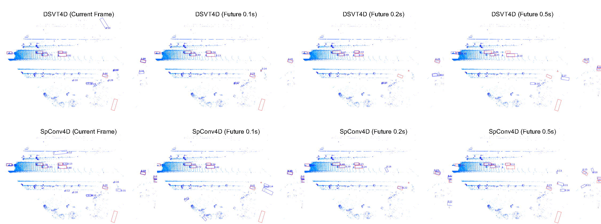

# Predictive Object Detection
POD: Predictive Object Detection with Single-Frame FMCW LiDAR Point Cloud

## Demo videos
The project demo videos.

https://github.com/user-attachments/assets/3fc85033-b2bc-4f13-9d37-2ccfba1e44e0

## Abstract
LiDAR-based 3D object detection is a fundamental task in the field of autonomous driving. This paper explores the unique advantage of Frequency Modulated Continuous Wave (FMCW) LiDAR in autonomous perception. Given a single frame FMCW point cloud with radial velocity measurements, we expect that our object detector can detect the short-term future locations of objects using only the current frame sensor data and demonstrate a fast ability to respond to intermediate danger. To achieve this, we extend the standard object detection task to a novel task named predictive object detection (POD), which aims to predict the short-term future location and dimensions of objects based solely on current observations. Typically, a motion prediction task requires historical sensor information to process the temporal contexts of each object, while our detector's avoidance of multi-frame historical information enables a much faster response time to potential dangers. The core advantage of FMCW LiDAR lies in the radial velocity associated with every reflected point. We propose a novel POD framework, the core idea of which is to generate a virtual future point using a ray casting mechanism, create virtual two-frame point clouds with the current and virtual future frames, and encode these two-frame voxel features with a sparse 4D encoder. Subsequently, the 4D voxel features are separated by temporal indices and remapped into two Bird's Eye View (BEV) features: one decoded for standard current frame object detection and the other for future predictive object detection. For the feature encoding of 4D virtual points, we extend two mainstream voxel encoders, Sparse Convolutional (SparseConv) VoxelNet and Voxel Transformer, to 4D SparseConv VoxelNet and 4D Voxel Transformer. We compare the accuracy and latency of the two 4D encoder networks. Extensive experiments on our in-house dataset demonstrate the state-of-the-art standard and predictive detection performance of the proposed POD framework.

## Visualizations

## Future Plan

We experiment on private data currently but we are collecting a large-scale open dataset with the FMCW LiDAR.

## Acknowledgements
Thanks to prior excellent open source projects:

- [OpenPCDet](https://github.com/open-mmlab/OpenPCDet)
- [DSVT](https://github.com/Haiyang-W/DSVT)

